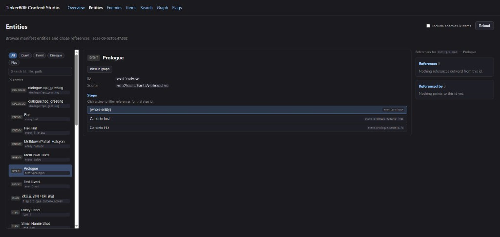
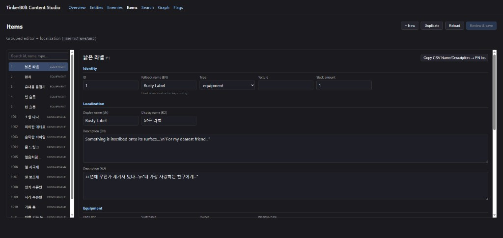

# Content Studio — public portfolio demo

Vue 3 **Content Studio** — 게임 콘텐츠(퀘스트·대화·아이템·플래그)를 **ID로 통일**하고, 브라우저에서 검색·편집·교차 참조를 볼 수 있는 CMS입니다.

이 공개 레포는 **픽션 샘플 데이터만** 포함합니다. 게임 본편 에셋·스토리 스포일러는 없습니다.

**Live demo:** https://amarok121.github.io/TinkerB0lt-ContentStudio/

---

## Screenshots / 스크린샷

개발 환경(private monorepo studio)에서 캡처한 **증거 화면**입니다. 라이브 데모는 샘플 데이터를 쓰지만, UI·워크플로는 동일합니다.

### 1. Entity browser · 엔티티 브라우저



**한국어**

- Godot에서 생성된 **콘텐츠 매니페스트**를 웹에서 한눈에 보는 화면입니다.
- 좌측에서 Quest / Event / Dialogue / Flag 등을 필터·검색하고, 중앙에서 ID·소스 경로(`.tres`)·스텝(step ID)을 확인합니다.
- 우측 **References / Referenced by**로 “이 이벤트가 무엇을 가리키는지 / 누가 이 이벤트를 쓰는지”를 바로 추적합니다. 기획·QA에서 영향 범위를 잡을 때 쓰는 패턴입니다.
- **View in graph**로 같은 엔티티를 관계 그래프 뷰로 넘길 수 있습니다.

**English**

Manifest-backed entity browser: filter by type, inspect stable IDs and Godot source paths, and see outgoing/incoming cross-references before editing content.

---

### 2. Item grouped editor · 아이템 그룹 에디터 + 로컬라이즈



**한국어**

- CSV에 흩어진 아이템 필드를 **Identity / Localization / Equipment** 등 그룹으로 묶어 편집합니다.
- `ITEM_{id}_NAME` / `DESC` 키로 **EN·KO 표시명·설명**을 같은 화면에서 관리합니다. CSV fallback name과 localization을 분리해 둔 구조입니다.
- `+ New` / `Duplicate` / **Review & save**(저장 전 diff)로 실무형 편집 루프를 지원합니다. (공개 데모는 read-only)

**English**

Grouped item editor with side-by-side EN/KO localization, type-specific field groups, and a save-diff workflow (full write path in the private monorepo; public Pages demo is read-only).

---

## Local preview

```bash
cd studio
npm install
npm run build:demo
npm run preview:demo
```

Open the URL shown (usually `http://localhost:4173`). Demo mode is **read-only**.

## What's included (sample data)

| Area | Sample |
|------|--------|
| Manifest | 2 quests, 1 event, 2 dialogues, 2 flags, 2 enemies, 3 items, 6 refs |
| CSV | Minimal enemy + item tables |
| Dialogues | JSON snippets searchable from the Search tab |
| Graph | Focus drill-down on `quest:demo_supply_run` etc. |

## Tech stack

- **Vue 3 + Vite + TypeScript**
- **TanStack Table** (CSV / spreadsheet views)
- **Vue Flow** (reference graph)
- Static JSON manifest pattern (same contract as the private Godot monorepo)
- GitHub Actions → GitHub Pages

## Architecture (한 줄)

```
Content ID 계약 → Manifest(entities + refs) → Content Studio(Vue) → CI 검증
```

게임 본편은 **비공개** 레포에 두고, 이 레포는 **아키텍처 + UI**를 샘플로 공개합니다.

## Private game repo

The full pipeline (Godot manifest generation, SET_FLAG runtime, CI validation, write-enabled studio) lives in a **private** repository. This public repo demonstrates the **authoring UI** and **content ID / manifest** architecture only.

## Portfolio links

- Live demo: https://amarok121.github.io/TinkerB0lt-ContentStudio/
- This repo: https://github.com/Amarok121/TinkerB0lt-ContentStudio

## License

MIT
