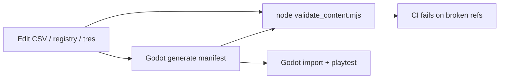

# TinkerB0lt Content Studio

Vue 3 + Vite web CMS for game content (portfolio + production).

## Repo layout: monorepo (recommended)

Keep **one repo** for now:

| Path | Role |
|------|------|
| `Assets/`, `Autoload/` | Godot runtime sources (.tres, CSV, JSON) |
| `content/` | Shared IDs, flags registry, generated manifest |
| `studio/` | Vue editor (reads/writes same files) |
| `tools/content_pipeline/` | Validate + manifest generation |

**Why monorepo (your case)**

- Solo/small team, no backend — studio writes CSV/JSON directly into the game tree
- One PR can update enemy stat + quest flag + manifest refs together
- Portfolio: one link shows game + tooling

**When to split repos**

- Large art/binary LFS (Anchorpoint-style: code repo vs asset repo)
- External writers need CMS access without the full Godot project
- Different release cadence (studio weekly, game monthly) with pinned submodule SHA

Split pattern: `TinkerB0lt_Game` (Godot) + `TinkerB0lt_Content` (CSV/registry only) as git submodule or npm workspace package.

## Quick start

```bash
cd studio
npm install
npm run dev
```

Open http://localhost:5173

### Workflow after editing CSV in the studio

1. **Save to repo** in Enemies / Items tab (writes CSV in-place)
2. **Godot import**
   - Enemies: run `Assets/PreFabs/Entity/Enemy/Definitions/import_enemy_definitions_csv.gd` (File → Run)
   - Items: saves **both** `item_data.csv` and `item_localization.csv`; re-open Godot (or focus project) so CSV → JSON + `.translation` reimport runs
3. **Regenerate manifest** (if quests/dialogues/flags changed too):

```bat
tools\content_pipeline\generate_manifest.bat
```

4. **Validate**

```bash
npm run validate:content
```

### Adding a new item in the studio

1. **Items** tab → **+ New** (blank) or **Duplicate** (copy selected item)
2. Confirm **Type** and suggested **ID** (consumable 1001+, equipment 1–999, etc.)
3. Fill **Localization** + type-specific fields → **Save both CSVs**
4. Re-open Godot for CSV → JSON + translation reimport

### Extending item fields later

- **Labeled UI:** add entries to `content/schema/item_fields.json` under the right group
- **Pattern columns** (e.g. `Fire_Amp`, `Elec_Amp`): match `auto_groups` with `*_Amp` — no studio code change
- **Other new CSV columns:** appear under **Additional columns (CSV)** until added to the schema

## Phase 1 features

- **Enemies** — editable spreadsheet (TanStack Table), save to repo CSV
- **Items** — grouped field editor + EN/KO localization; **+ New** / **Duplicate** with auto ID; saves both CSVs
- **Search** — global search across manifest + dialogue line text; dialogue tree preview
- **Graph** — focus neighborhood drill-down, side ref panel, link to Entities
- **Entities** — quest/event/dialogue/flag browser + References / Referenced by panels
- **Flags** — registry CRUD with diff preview + manifest backrefs
- **Validate** — run `validate_content` from Overview (dev API)
- **Flags** — read-only registry browser
- Dev-only write API (`POST /api/content/write`) — allowlisted paths only

Validate content (no Godot):

```bash
npm run validate:content
# or: node ../tools/content_pipeline/validate_content.mjs
```

CI runs the same validator on every PR to `main` (see `.github/workflows/content-ci.yml`).

Generate full manifest (Godot required):

1. Open project in Godot 4.4+
2. Run `tools/content_pipeline/generate_content_manifest.gd` → **File → Run**

## Data change workflow

When adding/changing quests, flags, items, etc.:



1. **Declare** new flags in `content/registries/flags_registry.json`
2. **Assign** stable IDs (`quest:…`, `flag:…`) in resources or id_map
3. **Edit** spreadsheet sources (enemy/item CSV)
4. **Run** `validate_content.mjs` — catches bad IDs, missing paths, orphan refs
5. **Run** manifest generator — refreshes `content/generated/content_manifest.json` cross-refs
6. **Commit** source + generated manifest in the same PR

## How studios / enterprises handle this

| Practice | Example | Your equivalent |
|----------|---------|-----------------|
| **Schema + validate in CI** | Charon `DATA VALIDATE`, JSON Schema | `validate_content.mjs` + `content/schema/` |
| **Generated manifest / refs** | Master `manifest.json`, CDN loaders | `content_manifest.json` |
| **Stable IDs, not display names** | Charon entity IDs | `kind:slug` IDs |
| **Reference checking** | `checkReferences`, `checkRequirements` | manifest `refs` + validator |
| **Monorepo for shared types** | Turborepo + shared SDK | `content/` shared by Godot + Vue |
| **Split binary vs code** | Separate art repo + LFS | Only if repo size hurts (not yet) |
| **Designer-facing CMS** | Charon Cloud, internal tools | `studio/` Vue app |

PR checklist (automate later in GitHub Actions):

- [ ] `node tools/content_pipeline/validate_content.mjs` passes
- [ ] Manifest regenerated if quests/events/dialogues changed
- [ ] New flags registered before use in dialogue/events
- [ ] Godot import smoke (open project, no script errors)

## Stack (Phase 1)

- **Vue 3 + TypeScript + Vite**
- CSV table UI (TanStack Vue Table — next)
- Graph: `@vue-flow/core` (next)
- Save → write CSV back to repo (next; needs careful path allowlist)

## Edit boundaries

| Web studio | Godot only |
|------------|------------|
| enemy_definitions.csv | AttackStep, Combo Graph |
| item_data.csv | Combat skill authoring |
| flags_registry.json | Scene placement, event steps |
| manifest (read) | Dialogue graph editor |
